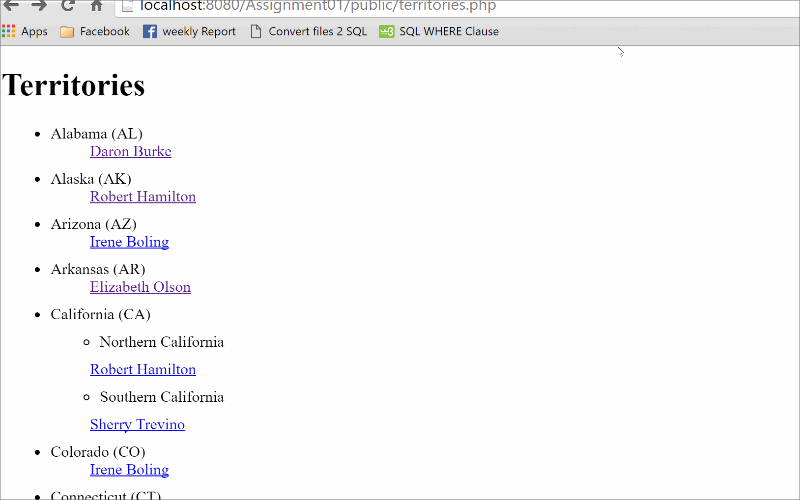

# Project 2 - Salesperson Territories

Time spent: 40 hours spent in total

## User Stories

The following **required** functionality is completed:

- [ ] 1: Public page: Territories
- [ ] 1: Public page: Salesperson

## Video Walkthrough

Here's a walkthrough of implemented user stories:

GIF created with [LiceCap](http://www.cockos.com/licecap/).

## Notes

I didn't have any coding experience prior to this assignment. Therefore, I spent most of my time reading the guides 
to gain some understanding of the different parts of the code, their meaning, and why each part was used. Even with the hints and the guides, 
it still consumed a large amount of time.

## License

    Copyright [2016] [Tiffany Benjamin]

    Licensed under the Apache License, Version 2.0 (the "License");
    you may not use this file except in compliance with the License.
    You may obtain a copy of the License at

        http://www.apache.org/licenses/LICENSE-2.0

    Unless required by applicable law or agreed to in writing, software
    distributed under the License is distributed on an "AS IS" BASIS,
    WITHOUT WARRANTIES OR CONDITIONS OF ANY KIND, either express or implied.
    See the License for the specific language governing permissions and
    limitations under the License.
